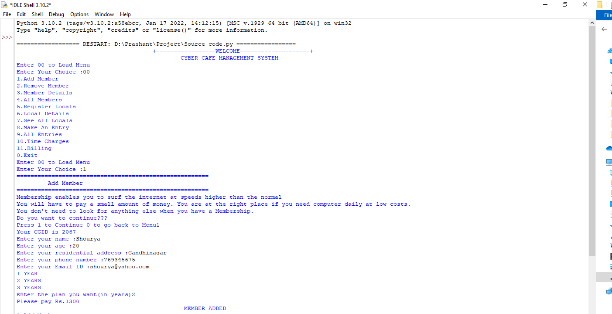
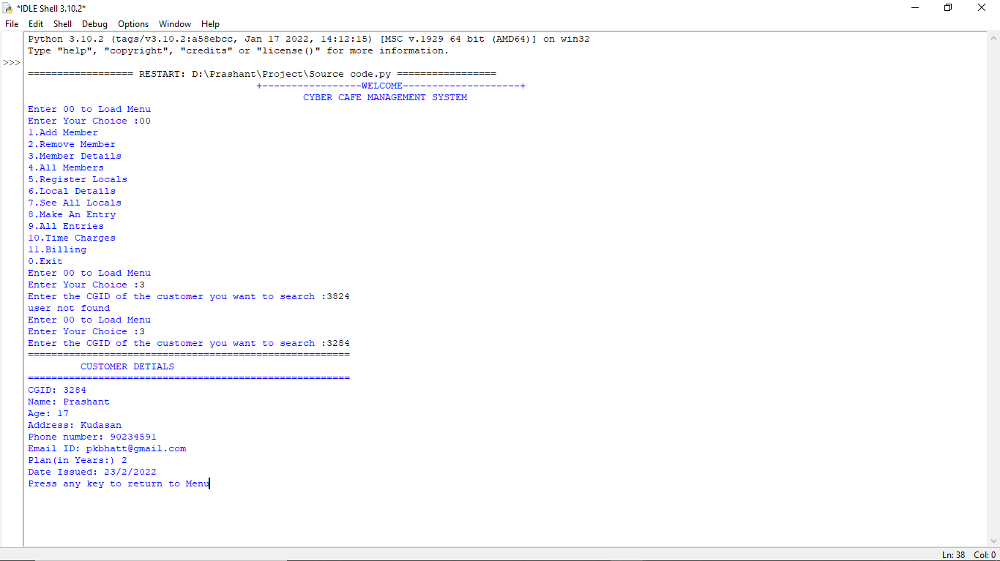
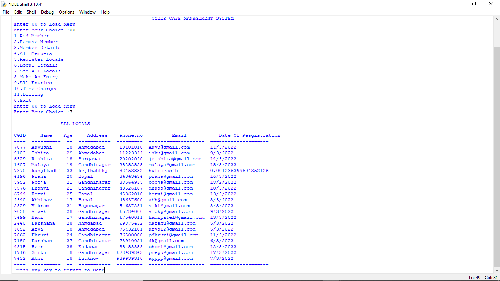

# 💻 Cyber Cafe Management System (CCMS)

A terminal-based management system for cyber cafes that allows member registration, local entry, billing, and record tracking. Built using Python and MySQL.

---

## 📌 Description

This project provides a command-line interface for managing members, local visitors, entries, and billing in a cyber cafe. It connects to a MySQL database, logs information, and stores detailed records.

---

## ✨ Features

- Add / Remove members
- Register non-members (locals)
- Log entry time and date
- Calculate time-based billing
- View, search, and list customer details
- Database-integrated structure using MySQL

---

## ⚙️ How to Run

> ⚠️ **Important:** You must run the database script first.

### 🔹 Step 1: Set Up Database
Run `Database craetor.py` to:
- Create MySQL database `ccms`
- Create required tables and preload data

```bash
python "Database craetor.py"
```

### 🔹 Step 2: Launch the Application
Run the source code to use the management system:

```bash
python "Source code.py"
```

---

## 🛠 Tech Stack

- **Language:** Python 3
- **Database:** MySQL (`mysql-connector-python`)
- **Interface:** Command-line / IDLE Shell

---

## 📂 File Structure

```
├── Database craetor.py      # Creates DB and tables, inserts demo data
├── Source code.py           # Main software logic
├── Homepage.png             # CLI screenshot (main menu)
├── Cust Details.png         # Member detail screen
├── 2.png                    # Billing example
├── View.png                 # View all locals data
└── README.md
```

---

## 🖼️ Screenshots

### 🔹 Menu System


### 🔹 Member Details


### 🔹 Billing Demo


### 🔹 Viewing Local Visitors


---

## 🧩 Future Scope

- GUI version with Tkinter or PyQt
- Admin login system
- Monthly usage reports
- Export reports in PDF/CSV formats

---

## 🧑‍💻 Author

**Prashant S.**  
🔗 [GitHub](https://github.com/Prashant1694)

---

## 📄 License

This project is for educational purposes only and is currently unlicensed.
